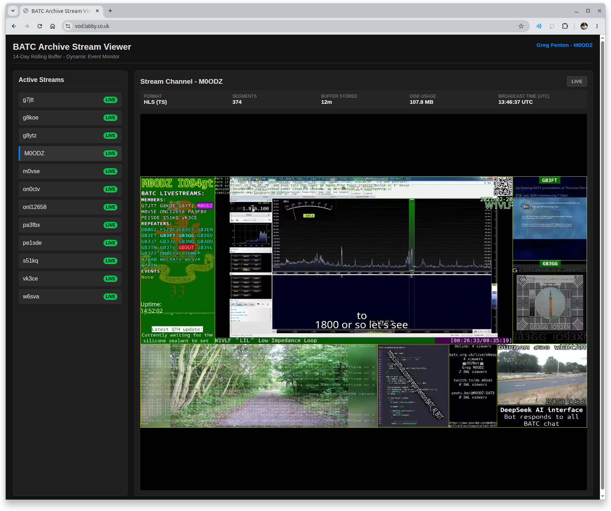

# BATC rolling 14-Day Stream Archive

  

[▶ Watch the screencast](https://github.com/user-attachments/assets/bcc7fbba-4d3a-4d7f-aca8-26cb16da497f)

A frontend and backend system for automatically archiving **BATC (British Amateur Television Club)** live streams into a rolling **14-day Video On Demand (VOD)** archive.

The system monitors available BATC streams, records transmissions as they appear, manages the archive retention period, and provides a web interface for browsing and watching recent broadcasts.

---

## Overview

BATC streams are often live-only transmissions. Once a stream ends, the content may no longer be available unless someone has recorded it.

The BATC Archive Stream Viewer provides an automated solution by:

- Monitoring BATC stream availability
- Detecting new and active streams
- Recording live transmissions automatically
- Maintaining a rolling 14-day archive
- Providing a web-based interface for viewing recent recordings

The aim is to make recent BATC activity available for replay without requiring individual operators to manually record streams.

---

## Features

### Backend

- Automatic discovery of BATC streams
- Detection of new live transmissions
- Automated recording of active streams
- Metadata handling for archived programmes
- Rolling archive management
- Automatic removal of recordings older than the retention period

### Frontend

- Web-based archive browser
- Browse recently recorded transmissions
- View stream information and recording details
- Playback of archived broadcasts
- Simple interface designed for amateur television operators

---

## Architecture

The system is split into two main components:

                 BATC Streams
                      |
                      v
              Stream Monitor
                      |
                      v
              Recording Backend
                      |
                      v
              14-Day VOD Archive
                      |
                      v
              Web Frontend Viewer

The backend is responsible for discovering streams, recording content, and maintaining the archive.

The frontend provides access to the stored recordings through a simple web interface.

---

## How It Works

1. The backend periodically checks BATC stream listings.
2. New live streams are detected automatically.
3. Active streams are recorded and stored.
4. Metadata is saved alongside each recording.
5. Recordings remain available for 14 days before being removed.
6. The frontend presents the archive for playback.

## Installation

### Requirements

- Linux server
- Node.js
- FFmpeg
- Web server
- Storage suitable for recorded video

---

## Deployment

The archive server can run on a Linux machine or server with sufficient storage.

The system requires:

- Node.js
- FFmpeg
- Web server
- Storage for recorded streams

---

## Configuration

Configuration options include:

- BATC stream source
- Archive retention period
- Recording location
- Web server settings
- Stream monitoring interval

---

## Running

Start the backend service:

    npm start

Then access the frontend through your configured web server.

---

## Project Status

This project is under active development.

Current focus:

- Improving archive reliability
- Enhancing metadata handling
- Improving frontend usability
- Expanding stream management features

---

## Future Improvements

Possible future additions:

- Searchable archive
- Programme thumbnails
- Improved stream metadata
- User authentication
- Archive statistics
- Operator-specific filtering
- Export/download options

---

## About BATC

The **British Amateur Television Club (BATC)** supports amateur television operators worldwide and provides facilities for sharing live amateur television streams.

This project is intended to complement the BATC streaming platform by providing a short-term archive of recent transmissions.

---

## License

Apache License 2.0

Copyright (c) 2026 Gregory Fenton
